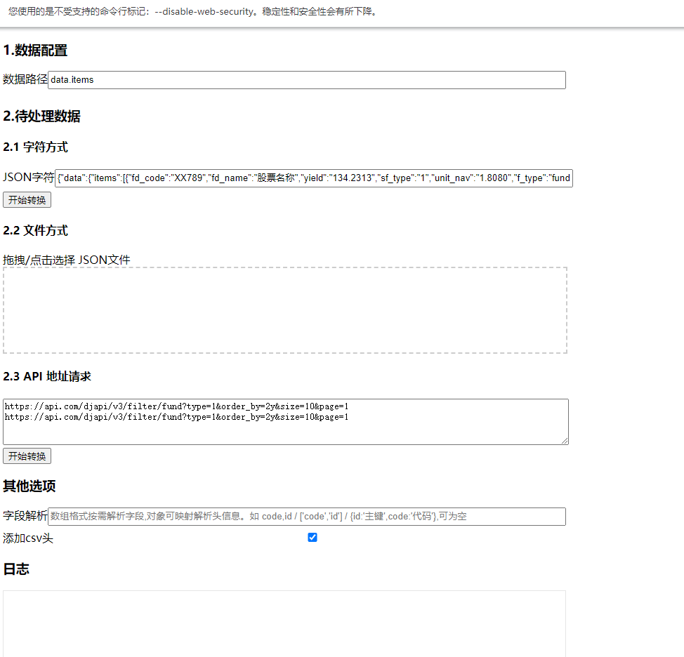
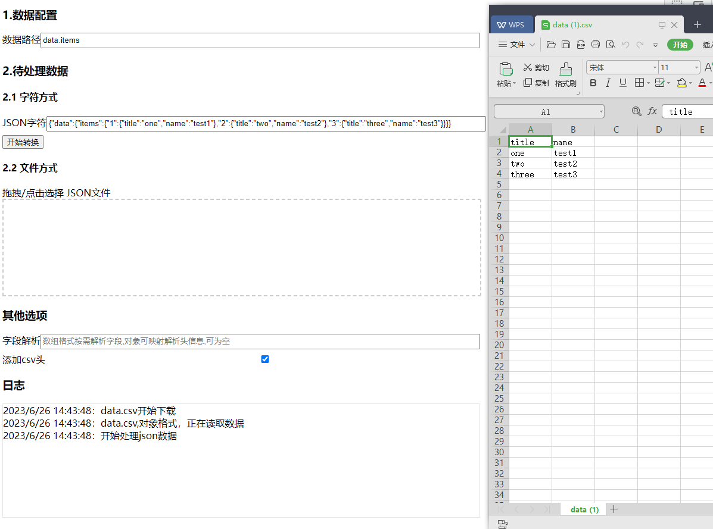
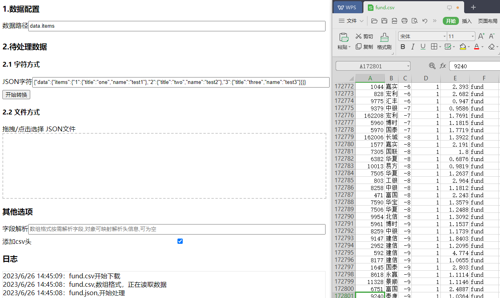

# Json2Csv
Js HTML 实现的一款通用型JSON数据提取工具，支持自动识别JSON数据节点并有序提取为CSV文件。  
Convenient JSON data extraction tool.

# 使用简介
> 浏览器打开 json2csv.html, 支持json字符、json文件、以及连续的api地址请求（跨域请求需关闭浏览器同源策略。）

 
## 数据配置
1. 数据路径：设置Json中数据所处路径，如'root.topics.data'  'data.items' ...
   
2. 字段解析：为空则为全量解析，自动识别字段头。可自定义 排序、映射、按需导出csv文件。

   * 假设数据
        *  [{"id":1,"name":"张三","age":19},{"id":2,"name":"李四","age":20}]
   * 按需排序 字段名逗号隔开（支持,隔开的字符串/数组格式)
        * name,id,age / ["age","name","id"]
   * 字段映射csv头 排序+按需导出 ，移除id列
        * {name:"名字",age:'年龄'}
3. 添加csv头：选择框 csv第一行是否包含字段信息。
   
4. 支持直接粘贴json字符串或拖拽上传json文件，生成为同名csv文件，支持多文件。


## 支持以下常见JSON数据格式：
### 1.*任意多级节点下的数组数据*
```json
{"data":{"items":[{"title":"one","price":23},{"title":"two","price":92},{"title":"three","price":5623}]}}
```
### 2.*兼容处理数据区域非数组结构而是一个对象的情况*
```json
{"data":{"items":{"1":{"title":"one","name":"test1"},"2":{"title":"two","name":"test2"},"3":{"title":"three","name":"test3"}}}}
```  
### 3. *支持非严格的JSON数据,字段名可 不加双引号 "" *
>使用动态创建函数，会遇到和 eval() 类似的的安全问题和（相对较小的）性能问题。与 eval() 不同的是，Function 构造函数创建的函数只能在全局作用域中运行。 [MDN Function介绍](https://developer.mozilla.org/zh-CN/docs/Web/JavaScript/Reference/Global_Objects/Function)
```javascript
{data:{items:[{title:"one",price:23},{"title":"two","price":92}]}}

/**
 * 小工具使用，存在的安全问题，可知可控。
 * @param str
 * @returns {null|*}
 */
function parseJson2(str) {
    try {
        return new Function('"use strict"; return '+str)();
    } catch (e) {
        addMsg("解析json失败")
        console.warn("Function解析失败", e);
        return null;
    }
}
```
## 谷歌浏览器 关闭同源策略方法
```text
1.建数据缓存文件夹：C:\MyChromeUserData
2.建立快捷方式： 桌面 → 右键 → 新建 → 快捷方式 → 输入对象目标地址:

"C:\Program Files\Google\Chrome\Application\chrome.exe" --allow-file-access-from-files --user-data-dir="C:\MyChromeUserData" --disable-web-security
```

数据位于"data.items"多级节点下，则填写【数据路径】，如`data.items`


本地测试，秒级处理20M json文件，Chrome 版本 114.0.5735.134（正式版本） （64 位）



